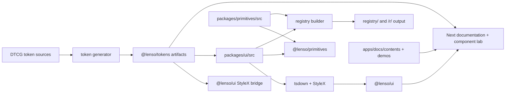

# Lenso UI architecture

Lenso UI is an independent public design system. It owns reusable, product-neutral interface foundations while Consumers retain ownership of product concepts, routing, persistence, assets, and product-specific composition.

The repository has two public delivery channels and one shared source model:



## Public boundaries

### `@lenso/ui`

`@lenso/ui` contains styled Foundation Components and visual adapters. It exposes explicit family subpaths such as `@lenso/ui/button`, `@lenso/ui/dialog`, and `@lenso/ui/sidebar`. Consumers import the generated StyleX CSS explicitly through `@lenso/ui/styles.css`.

The package is intentionally thin over Base UI. Base UI owns the underlying interaction model where a suitable primitive exists; Lenso UI adds the visual contract, semantic token usage, state-layer conventions, `data-slot` markers, and replaceable built-in icon slots.

The current `Sidebar` adapter is the important boundary case: it consumes `@lenso/primitives/sidebar` and gives the headless primitive a StyleX visual layer. This is still a one-way dependency; the primitive package never imports `@lenso/ui`.

### `@lenso/primitives`

`@lenso/primitives` contains headless Product Primitives. The current public surface is `@lenso/primitives/sidebar`, which owns controlled and uncontrolled open state, left/right instances, nested Roots, targeting, dismissal, and focus restoration without StyleX, theme tokens, default CSS, or an animation runtime.

Consumers that need a different visual language can use the primitive directly. Consumers that want the Lenso visual layer can use `@lenso/ui/sidebar` or install the editable registry Sidebar Recipe.

### `@lenso/tokens`

The token package publishes the resolved semantic contract used by both package and registry channels. The authoritative inputs are:

- `packages/tokens/src/foundation.json` for primitive values.
- `packages/tokens/src/semantic.json` for public semantic roles.
- `packages/tokens/src/themes/light.json` and `dark.json` for complete theme contexts.
- `packages/tokens/src/lenso.resolver.json` for resolution order and theme selection.

The generator produces CSS custom properties, TypeScript names and theme values, StyleX variables, DTCG and contract manifests, the Figma mapping, and a Consumer theme adapter. Generated outputs are checked into the repository so package and registry builds consume the same resolved data.

Public CSS names are complete, unbranded semantic paths such as `--color-surface-canvas` and `--color-content-primary`. Primitive values and component-to-token mappings are implementation details.

### Registry distribution

The registry is the editable source channel. `tooling/registry-builder/src/cli.ts` describes each item and reads canonical package or primitive sources to create shadcn-compatible JSON. `registry/parity-manifest.json` records the source file, target file, and SHA-256 hashes.

The generated public endpoints have two identities:

- `/r/{name}.json` is the stable alias for the current generated registry.
- `/r/v/{version}/{name}.json` is an immutable release snapshot.

During ordinary development, `pnpm generate` refreshes the stable output. The release snapshot step runs with `LENSO_REGISTRY_SNAPSHOT=1`; it writes the versioned output only when that path does not already exist, or when the bytes match the existing snapshot.

Registry installations are Consumer-owned copies. They may be structurally changed, renamed, or forked. A future upgrade must be applied as a source diff; the registry does not promise to overwrite local edits automatically.

## Source and generated artifact rules

The canonical implementation lives in the owning workspace. The package and registry channels are projections of that source, not independent behavior implementations.

When source inputs change:

```bash
pnpm generate
pnpm --filter @lenso/token-generator check-generated
```

Review and commit the resulting generated changes together with their source change. Important generated locations include `packages/tokens/src`, `packages/ui/src/tokens.stylex.ts`, `registry/components`, `registry/setup/setup.json`, `registry/registry.json`, `registry/parity-manifest.json`, `registry/tokens.stylex.ts`, and `apps/docs/public/r`.

## Theme and portal model

Lenso UI provides complete Light and Dark defaults but does not own a Consumer's appearance preference. `ThemeScope` establishes a subtree theme and merges partial semantic-token overrides with its nearest parent scope. Portalled component content can use the nearest scope's body-level host, so an overlay does not lose its theme because of subtree clipping or stacking contexts.

Consumers resolve system preference and persistence outside Lenso UI, then pass an explicit theme to the scope. Product theme bundles, brand assets, and product-specific semantic composition remain Consumer-owned.

`CSPProvider`, toast, dialog, and other component-domain providers stay independent. There is no mandatory global Lenso provider that combines unrelated theme, portal, CSP, and interaction responsibilities.

## Documentation and verification

`apps/docs` is both the public Next App Router documentation site and the component lab. MDX content, playground JSON, demo modules, package examples, and documentation navigation are part of the product surface.

The repository verifies the public seam through:

- strict TypeScript declarations and named subpath exports;
- package and registry schema validation;
- source-local Node and browser tests with Playwright;
- `axe-core` checks for relevant component trees;
- Light/Dark state boards and Figma-approved baselines;
- generated-artifact freshness and parity hashes;
- CI builds and the Changesets release workflow.

The current public package line is `0.2.0`. `@lenso/ui`, `@lenso/primitives`, and `@lenso/tokens` are a Changesets fixed group; `@lenso/fonts` remains private until its font asset provenance is complete.

## Decision history note

Early architecture decisions described the Sidebar visual layer as registry-only and stated that `@lenso/ui` would not depend on `@lenso/primitives`. The current implementation intentionally uses `@lenso/primitives/sidebar` from `@lenso/ui/sidebar`, so the styled package and the registry Recipe can share one headless behavior source. ADR-0034 records this current boundary and supersedes the conflicting wording in ADR-0009 and ADR-0020.
